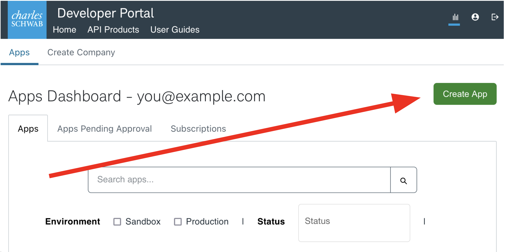
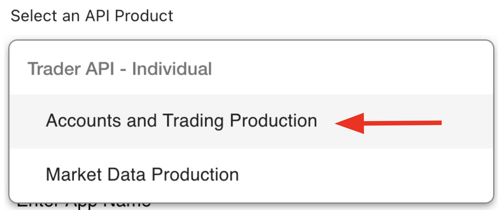
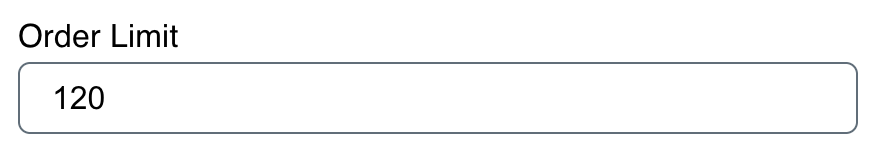
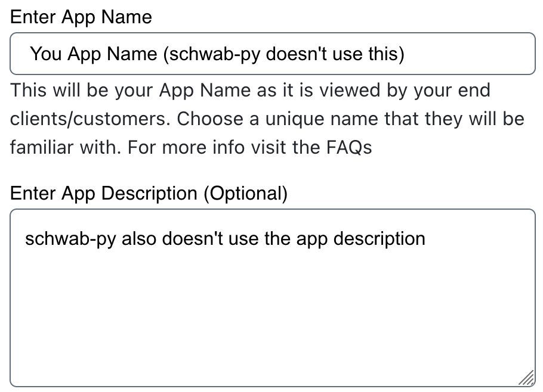
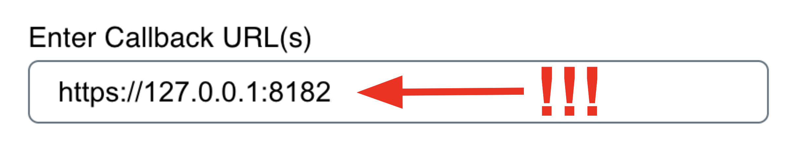
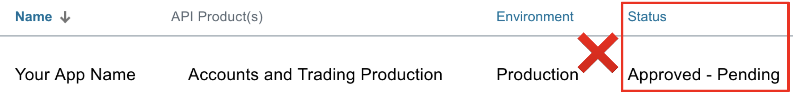
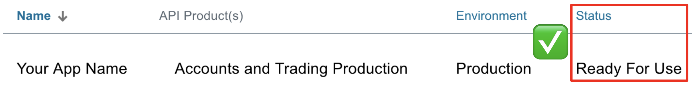
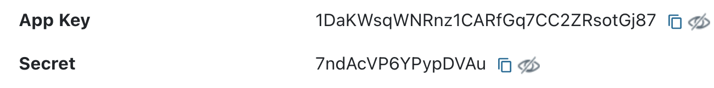

.. _getting_started:

===============
Getting Started
===============

Welcome to ``schwaby``! Read this page to learn how to install and configure 
your first Schwab Python application.

.. warning::

   This library places real orders against real accounts, there is no paper
   trading, and it has bugs --- see the caution on :ref:`the front page
   <index>`. Everything you place with it is your responsibility and your risk.

+++++++++++++++++
Schwab API Access
+++++++++++++++++

Before we do anything with ``schwaby``, you'll need to create a developer 
account with Schwab and register an application. By the end of this section, 
you'll have accomplished the three prerequisites for using ``schwaby``:

1. Create an application.
#. Choose and save the callback URL (important for authenticating).
#. Receive an app key and a secret.

**Create a Developer Account**

You can create a developer account `here 
<https://developer.schwab.com/>`__.  The instructions from here on out 
assume you're logged in, so make sure you log into the developer site after 
you've created your account.

**Create an Application**

Next, from your dashboard on the `developer site
<https://developer.schwab.com/>`__, create an application and populate the
required fields.

**API Product**

The first thing you'll select is the API Product. Schwab does not document the
difference between "Accounts and Trading Production" and "Market Data" in a way
that settles the question, but the former grants access to every endpoint
``schwaby`` supports, including quotes and price history. Choose that one unless
you have a specific reason not to.

**Order Limit**

The order limit is the number of order-related requests your app will be 
permitted to place each minute. If you make, cancel, or replace more than this 
many orders each minute, you'll be throttled and your orders will be rejected.  
Most users have no reason to restrict this, so we recommend setting this to 120.

**App Name and Description**

Next are the app name and description. ``schwaby`` does not use these values, 
but the folks at at Schwab might. We recommend being descriptive here, if only 
so that users and app approvers know what your app will do.

**App Name and Description**

Finally, we have the callback URL. This one is important.  In a nutshell, the 
`OAuth login flow
<https://requests-oauthlib.readthedocs.io/en/
latest/oauth2_workflow.html#web-application-flow>`__ that Schwab uses works by 
opening a login page, securely collecting credentials on their domain, and then 
sending an HTTP request to the callback URL with ingredients for the token in 
the URL query.

The vast majority of users should set their callback URL to 
``https://127.0.0.1:8182`` (note the lack of a trailing slash). This means that 
once the login flow is completed, the generated credentials are sent back to 
your machine at port ``8182``, rather than any external server. Setting a port 
number is not require to use ``schwaby``, but it is required to use 
:ref:`certain convenient features <login_flow>`.  Advanced users may be able to 
use a non-local callback URL, but this documentation assumes they are advanced 
enough not to need our help creating such a setup.

If Schwab refuses to create an app with a ``127.0.0.1`` callback URL, please
`open an issue <https://github.com/Hu1kSmash/schwaby/issues>`__ --- it has
happened intermittently in the past and it is worth knowing if it is still
happening.

Note that whatever callback URL you choose, you must pass it to 
``schwaby`` *exactly* in the same way as you specified it while creating your 
app.  Any deviation (including adding or removing a trailing slash!) can cause 
difficult-to-debug issues. Be careful not to mis-copy this value.

.. _approved_pending:

**Waiting for Approval**

After your app is created, you will likely see it in an ``Approved - Pending`` 
state when you view it in your dashboard. Don't be fooled by the word 
``Approved``: your app is not yet ready for use. You must wait for Schwab to 
*actually* approve it, at which point its status will be ``Ready For Use.`` This 
can take up to a few days. Only then can you proceed to using ``schwaby``.

**Client Secrets**

Once your app is created and approved, you will be able to access your app key
and app secret by clicking through to your approved application in the 
dashobard. Neither  of these are meant to be shared by anyone, so keep them safe 
(the ones displayed here are fake). You will also be required to pass these into 
``schwaby``.  This library does not share these values with anyone except 
official Schwab endpoints, not even its authors. Don't share them with anyone.

++++++++++++++++++++++++
Installing ``schwaby``
++++++++++++++++++++++++

This section outlines the installation process for client users. For developers, 
check out :ref:`contributing`.

The recommended method of installing ``schwaby`` is using ``pip`` from
`PyPi <https://pypi.org/project/schwaby/>`__ in a `virtualenv <https://
virtualenv.pypa.io/en/latest/>`__. First create a virtualenv in your project 
directory. Here we assume your virtualenv is called ``my-venv``:

.. code-block:: shell

  pip install virtualenv
  virtualenv -v my-venv
  source my-venv/bin/activate

You are now ready to install ``schwaby``. The distribution is ``schwaby`` and
the importable package is ``schwab`` --- ``pip install schwab-py`` would fetch
the *original* project, which is a different and much older codebase:

.. code-block:: shell

  pip install schwaby

.. warning::

  ``schwaby`` and ``schwab-py`` cannot be installed together, and installing
  one over the other is worse than it sounds. Both provide the ``schwab``
  package and ``pip`` does not know they are the same project, so both end up
  registered and both claim the same files.

  Modules removed in the newer version survive on disk and stay importable. And
  ``pip uninstall schwab-py`` afterwards deletes the shared files and destroys
  the install --- ``pip`` still lists ``schwaby``, but ``import schwab`` raises
  ``ModuleNotFoundError``.

  ``pip`` never warns about this --- it does not implement
  ``Conflicts-Dist``, and a wheel runs no code when it is installed.
  ``import schwab`` does warn, but **only if** ``schwaby`` was installed
  last: both projects ship a ``schwab/__init__.py``, whichever is installed
  second overwrites the other's, and installing ``schwab-py`` over
  ``schwaby`` removes the file that carries the check. Silence is not
  evidence that the install is clean.

  Migrating from ``schwab-py``? Uninstall it **first**:

  .. code-block:: shell

    pip uninstall -y schwab-py && pip install schwaby

That's it! You're done! You can verify the install succeeded by importing the
package:

.. code-block:: python

  import schwab

If this succeeded, you're ready to move on to :ref:`auth`.

Note that if you are using a virtual environment and switch to a new terminal
your virtual environment will not be active in the new terminal, and you need to
run the activate command again. If you want to disable the loaded virtual
environment in the same terminal window, use the command:

.. code-block:: shell

  deactivate

++++++++++++
Getting Help
++++++++++++

If you are ever stuck, you can `open an issue <https://github.com/Hu1kSmash/schwaby/issues>`__ to ask a 
question. If you feel you've found a bug, you can :ref:`fill out a bug report 
<help>`.
